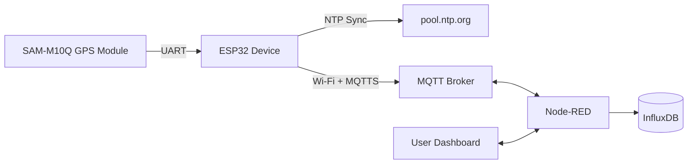
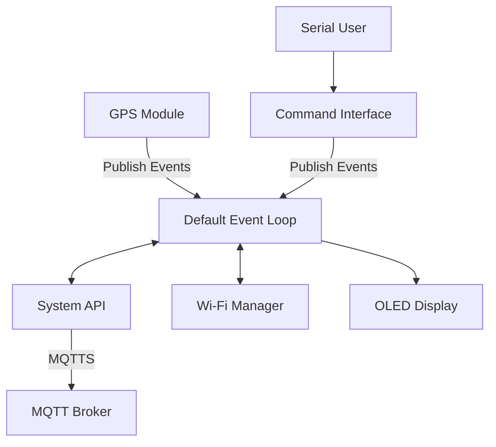
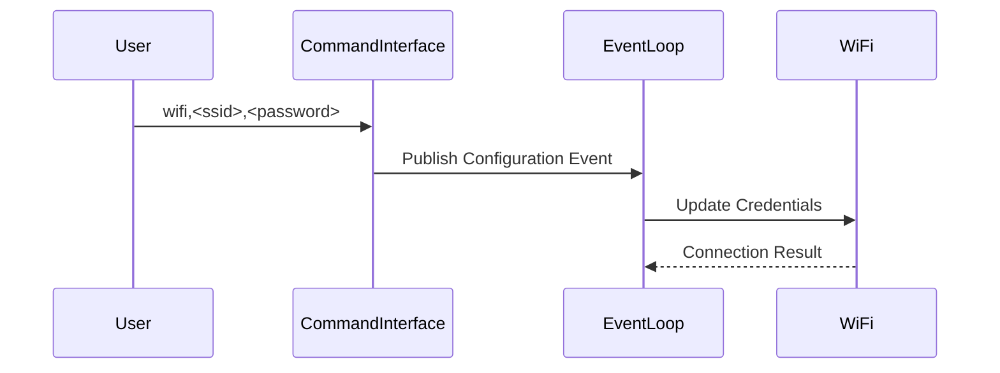
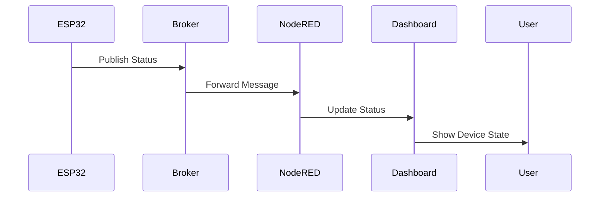
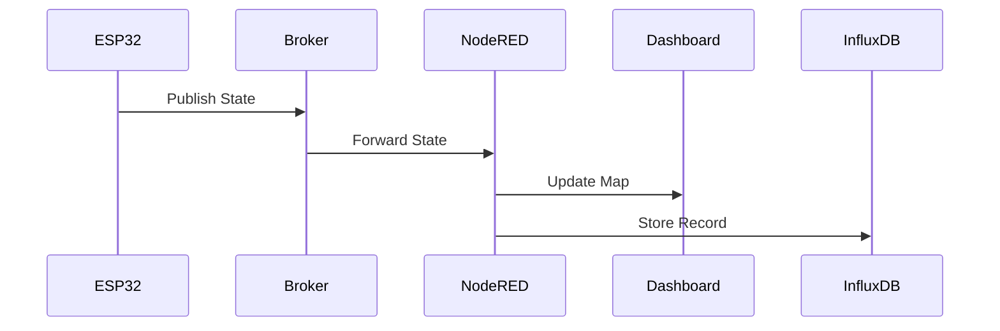
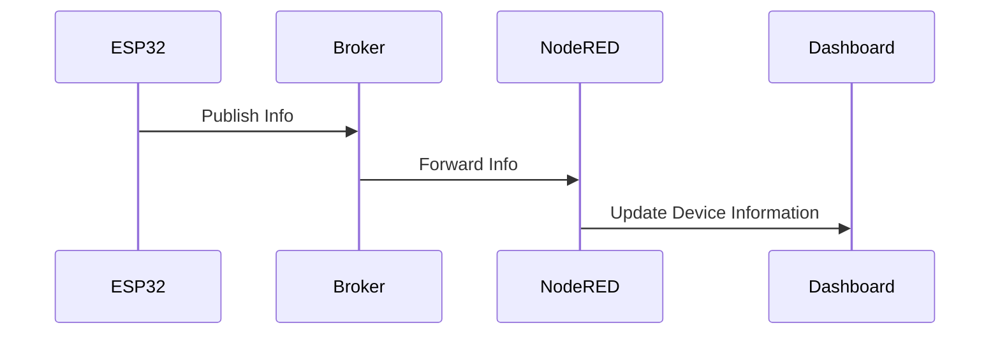

# Project Report: IoT Vehicle Tracking System

<div align="center">
  
</div>

## 1. Introduction

The objective of this project is to develop an IoT-based vehicle tracking system capable of collecting, transmitting, storing, and visualizing GPS location data in real time. The system monitors geographic coordinates, altitude, speed, heading, and device status, allowing users to track vehicle movements and review historical routes through a web dashboard.

<div align="center">

<br>
<em>Figure 1 - Hardware Circuit</em>
</div>

---

## 2. System Architecture

The solution is composed of embedded hardware, cloud communication services, a data storage layer, and a visualization interface.

### Technologies Used

| Component             | Description                                        |
| --------------------- | -------------------------------------------------- |
| ESP32                 | Provides Wi-Fi connectivity and system control     |
| SAM-M10Q GPS Module   | Acquires GPS positioning data                      |
| OLED Display (128×64) | Displays device status and diagnostic information  |
| ESP-IDF               | Development framework for ESP32                    |
| FreeRTOS              | Real-time operating system used by ESP-IDF         |
| HiveMQ                | MQTT broker hosting platform                       |
| Node-RED              | Message processing, automation, and user dashboard |
| InfluxDB              | Time-series database used to store tracking data   |

### System Diagram



---

## 3. ESP32 Application Architecture

The embedded application follows an event-driven architecture using the ESP-IDF Event Loop.

### Application Components



### Component Responsibilities

#### GPS Module

Responsible for communication with the SAM-M10Q GPS receiver and generation of location events.

#### System API

Handles MQTT communication, system synchronization, and internal time management.

#### Wi-Fi Manager

Responsible for network connectivity and reconnection procedures.

#### OLED Display

Displays operational information and diagnostics.

#### Command Interface

Receives commands through the serial interface, such as Wi-Fi credential updates.

---

## 4. Security

Communication between devices and the MQTT broker uses MQTTS (MQTT over TLS). Certificate validation is performed using the ESP-IDF built-in certificate bundle. MQTT authentication requires valid user credentials.

Node-RED also connects securely to the broker using TLS authentication.

InfluxDB operates locally and is not exposed to external networks, reducing the attack surface of the system.

---

## 5. Sequence Diagrams

### Wi-Fi Configuration



---

### MQTT Connection and Device Status

The device publishes its online status using MQTT Last Will and Testament (LWT).

**Topic**

```text
/tracking_device/<id>/status
```

**Payload**

```json
{
  "online": true
}
```



---

### Device State Transmission

**Topic**

```text
/tracking_device/<id>/state
```

**Payload**

```json
{
  "latitude": 0.0,
  "longitude": 0.0,
  "altitude": 0.0,
  "speed_kmh": 0.0,
  "course_deg": 0.0,
  "satellites": 0,
  "hdop": 0,
  "timestamp": 0,
  "time_on": 0
}
```



---

### Device Information Transmission

**Topic**

```text
/tracking_device/<id>/info
```

**Payload**

```json
{
  "ip": "192.168.1.100",
  "timestamp": 0,
  "time_on": 0
}
```



---

## 6. Node-RED Flows

### Get Last Device State

Queries InfluxDB for the latest known position of each device within the last 30 days and displays the results on the map.

<div align="center">

</div>

---

### Clear Paths

Removes all displayed routes from the map interface.

<div align="center">

</div>

---

### Store Device State

Processes incoming state messages and stores them in InfluxDB.

<div align="center">

</div>

---

### SIM Device

Generates simulated GPS data for testing and demonstration purposes.

<div align="center">

</div>

---

### Update Device Information

Updates the dashboard with current device information and provides actions such as focusing the map on a selected device or retrieving historical routes.

<div align="center">

</div>

---

## 7. User Interface

### No Connected Devices

Dashboard state when no devices are online.

<div align="center">

</div>

---

### Simulated Device Online

Dashboard displaying an active simulated device.

<div align="center">

</div>

---

### Historical Route Visualization

Dashboard displaying the historical route of the simulated device.

<div align="center">

</div>

---

## 8. Conclusion

The developed system successfully demonstrates an end-to-end IoT tracking solution capable of collecting GPS information, transmitting data securely through MQTT, storing historical records in a time-series database, and providing real-time visualization through a web dashboard. The modular architecture based on ESP-IDF, FreeRTOS, Node-RED, and InfluxDB allows the platform to be easily extended for additional telemetry data, fleet monitoring, and advanced analytics.
