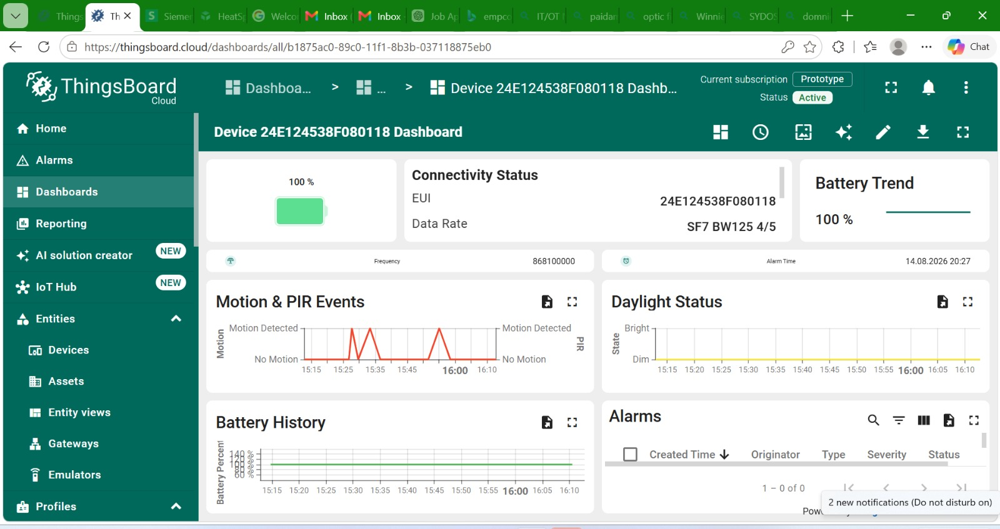
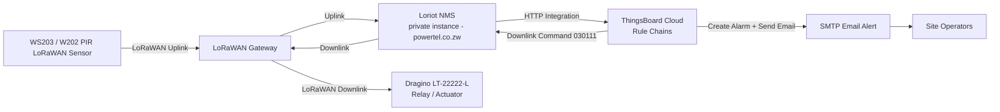
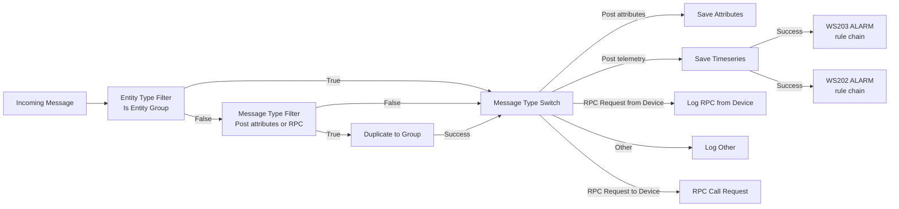
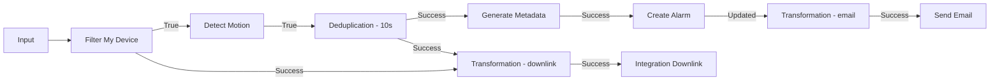
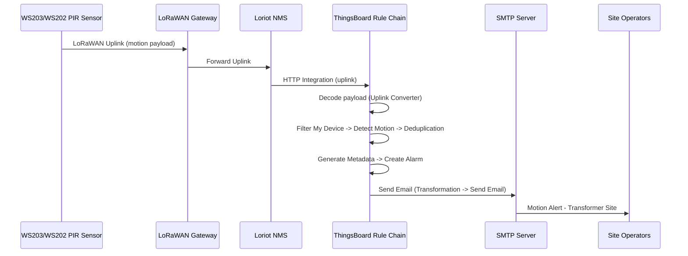
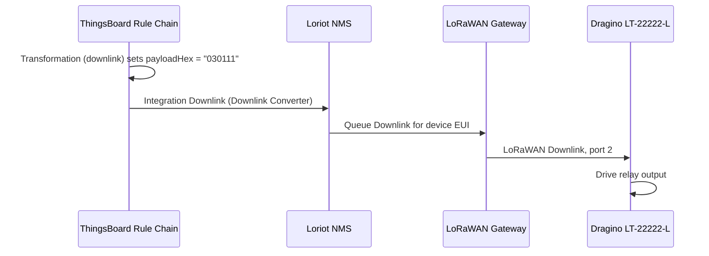

# Project Report: IoT Transformer Vandalism and Intrusion Detection System

<div align="center">

</div>

## 1. Introduction

This project delivers an automated IoT security system for detecting and alerting on vandalism, theft, and unauthorized intrusion at unmanned distribution transformer sites. It uses a LoRaWAN-connected PIR motion sensor to detect physical intrusion events, a private LoRaWAN network server for message routing, a cloud IoT platform for rule processing and alerting, and a relay/actuator node capable of triggering a local response — all without depending on site power or wired connectivity.

<div align="center">

<br>
<em>Figure 1 - Hardware Circuit</em>
</div>
---

## 2. System Architecture

The solution combines a battery-powered LoRaWAN sensor node, a private LoRaWAN network server, a cloud IoT rule engine, and a relay/actuator node for local response.

### Technologies Used

| Component | Description |
|---|---|
| WS203 PIR LoRaWAN Sensor | Detects motion/intrusion at the transformer site and transmits uplink events over LoRaWAN |
| Dragino LT-22222-L | LoRaWAN relay/actuator node — receives downlink commands to drive relay outputs |
| LoRaWAN Gateway | Forwards sensor uplinks to the network server and delivers downlinks back to field nodes |
| Loriot NMS (private instance) | LoRaWAN Network Server — manages device sessions, uplink/downlink routing, and payload decoding/encoding |
| ThingsBoard Cloud | IoT platform for rule-chain processing, alerting logic, dashboards, and downlink orchestration |
| TBEL | ThingsBoard Expression Language used for rule-chain payload encoding/decoding |
| Email/SMTP Alerting | Notifies site operators when an intrusion event is confirmed |


### System Diagram



*Figure 2 - Guardian end-to-end data flow: sensor uplink triggers a ThingsBoard rule chain, which raises an alarm, emails site operators, and issues a downlink to actuate the relay node.*

---

## 3. ThingsBoard Rule Chain Architecture

Rule processing runs entirely in ThingsBoard Cloud, split into a **Root Rule Chain** that routes incoming messages, and one **device-specific alarm chain per sensor** (`WS202 ALARM`, `WS203 ALARM`).


*Figure 3 - The three rule chains configured in ThingsBoard: Root Rule Chain, WS202 ALARM, WS203 ALARM.*

### Root Rule Chain



*Figure 4 - Root Rule Chain: telemetry is saved, then forwarded into both device alarm chains, which each filter for their own device.*

### Device Alarm Chain (WS202 ALARM / WS203 ALARM)

Both device chains share the same structure — one instance per sensor:



*Figure 5 - Device alarm chain: a confirmed motion event both raises a ThingsBoard alarm + email, and independently triggers a downlink back to the relay node.*


*Figure 6 - WS202 ALARM rule chain as configured in ThingsBoard.*


*Figure 7 - WS203 ALARM rule chain as configured in ThingsBoard.*

---

## 4. Security

- The LoRaWAN network is served by a **private Loriot NMS instance** (`lorawan.powertel.co.zw`), rather than a public network server, limiting exposure of device sessions and payloads.
- The Loriot–ThingsBoard integration is authenticated with an **Application Access Token**, scoped to a single Loriot Application ID.
- Downlinks to the relay node are only issued by the rule chain after a filtered, deduplicated, positively-identified motion event — reducing the chance of spurious relay actuation.
- Alert emails are sent over **SMTP with TLS (TLSv1.2) enabled**.
- ThingsBoard Cloud sits behind account-level authentication; rule chain and integration credentials are not stored in device firmware.


*Figure 8 - Loriot → ThingsBoard integration configuration (Application Access Token redacted).*

> **Note:** the Application Access Token and Downlink URL shown above are live credentials for this deployment. Treat this screenshot as sensitive — do not publish an unredacted version, and rotate the token if it has ever been shared outside the team.

---

## 5. Sequence Diagrams

### Intrusion Alert Flow



### Relay Trigger (Downlink) Flow



---

## 6. Rule Chain Scripts (TBEL)

### Uplink Converter — Payload Decoder

Decodes raw LoRaWAN bytes from the WS203/W202 sensors into telemetry values (battery, temperature, PIR trigger, humidity, daylight, occupancy/motion).

```javascript
function payloadDecoder(payload, metadata) {
    var values = {};

    for (var i = 0; i < payload.length;) {
        var channel = payload[i++];
        var type = payload[i++];

        // Battery (WS203 + W202)
        if (channel === 0x01 && type === 0x75) {
            var battery = payload[i];
            if (battery >= 0 && battery <= 100) {
                values.battery = battery;
            }
            i += 1;
        }
        // Temperature (WS203)
        else if (channel === 0x03 && type === 0x67) {
            var temp = (payload[i] | (payload[i + 1] << 8));
            if (temp > 32767) {
                temp -= 65536;
            }
            values.temperature = temp / 10;
            i += 2;
        }
        // PIR Status (W202)
        else if (channel === 0x03 && type === 0x00) {
            values.pir = payload[i] === 1 ? "trigger" : "normal";
            values.motion = payload[i] === 1 ? 1 : 0;
            i += 1;
        }
        // Humidity (WS203)
        else if (channel === 0x04 && type === 0x68) {
            values.humidity = payload[i] / 2;
            i += 1;
        }
        // Daylight (W202)
        else if (channel === 0x04 && type === 0x00) {
            values.daylight = payload[i] === 1 ? "bright" : "dim";
            i += 1;
        }
        // Occupancy (WS203)
        else if (channel === 0x05 && type === 0x00) {
            values.occupancy = payload[i];
            values.motion = payload[i] === 1 ? 1 : 0;
            i += 1;
        }
        else {
            i += 1;
        }
    }

    return {
        telemetry: {
            ts: metadata.ts,
            values: values
        },
        attributes: {}
    };
}

return payloadDecoder(payload, metadata);
```

**Telemetry keys produced:** `battery`, `motion`, `occupancy`, `temperature`, `humidity`, `event`, `motion_triggered`, `pir`, `daylight`

**Integration endpoint:**
`https://thingsboard.cloud/api/v1/integrations/loriot/<integration-id>`

### Downlink Converter

Builds the relay-trigger downlink sent back to the device (`030111` hex = relay ON command) on port 2.

```javascript
var hexData = msg.payloadHex != null ? msg.payloadHex : "030111";

return {
    contentType: "JSON",
    data: hexData,
    metadata: {
        EUI: "<device-eui>",
        port: 2,
        isHexEncoded: "true"
    }
};
```

### Device Alarm Chain Scripts

**Filter My Device**

```javascript
return metadata.deviceName != null &&
       metadata.deviceName === "<device-name>";
```

**Detect Motion**

```javascript
var motion;
if (msg.motion != null) {
    motion = msg.motion;
} else {
    motion = msg.data.motion;
}

if (motion != 1 && motion !== "1" && motion !== true) {
    return false;
}

return true;
```

**Generate Metadata**

```javascript
metadata.subject = "Motion Alert - Transformer Site";
metadata.body = "Motion detected on device: " + metadata.deviceName +
                "\nTime: " + new Date(parseInt(metadata.ts)).toString() +
                "\nTemperature: " + msg.temperature + "°C" +
                "\nHumidity: " + msg.humidity + "%" +
                "\nBattery: " + msg.battery;

return {msg: msg, metadata: metadata, msgType: msgType};
```

**Create Alarm**

```javascript
var details = {};
if (metadata.prevAlarmDetails) {
    details = JSON.parse(metadata.prevAlarmDetails);
    // remove prevAlarmDetails from metadata
    delete metadata.prevAlarmDetails;
    // now metadata is the same as it comes IN this rule node
}

return details;
```

**Transformation (Send Email)**

```javascript
return {
    msg: {
        to: "<alert-recipients>",
        subject: "Motion Detected",
        body: "Motion detected from " + metadata.deviceName
    },
    metadata: metadata,
    msgType: "SEND_EMAIL"
};
```

**Transformation (Downlink)**

```javascript
msg.payloadHex = "030111";

return {
  msg: msg,
  metadata: metadata,
  msgType: msgType
};
```

### Send Email Node Configuration


*Figure 9 - SMTP configuration for the Send Email node (TLS enabled, TLSv1.2).*

> **Check:** the SMTP host in this configuration currently reads `smtp.gmail.com1` — the trailing `1` looks like a typo and should be verified/corrected to `smtp.gmail.com`.

---

## 7. Conclusion

The developed system successfully demonstrates an end-to-end IoT intrusion detection solution for unmanned distribution transformer sites. LoRaWAN PIR sensors report motion events through a private Loriot network server into ThingsBoard Cloud, where rule chains decode the payload, deduplicate repeated triggers, raise an alarm, notify site operators by email, and issue a downlink command to actuate a relay/actuator node — all without relying on site power or wired connectivity. The modular rule-chain architecture (Root Rule Chain plus per-device alarm chains) allows the platform to be extended to additional sensor types and transformer sites with minimal changes.
