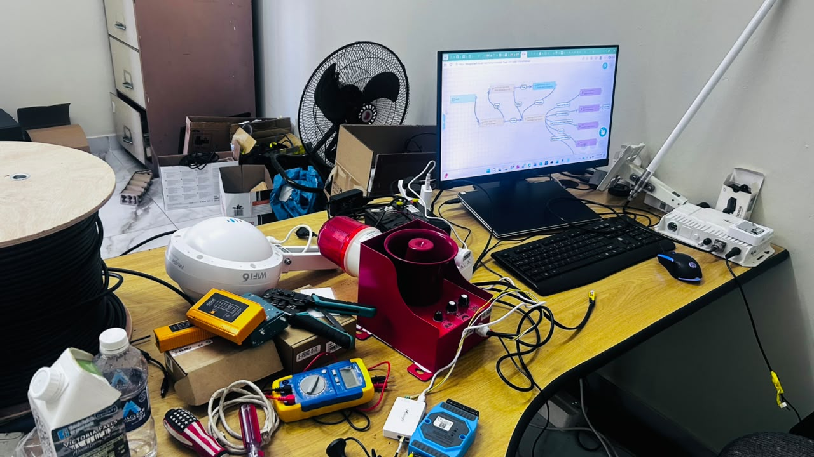

# Project Report: IoT Transformer Vandalism and Intrusion Detection System

## 1. Introduction

This project delivers an automated IoT security system for detecting and alerting on vandalism, theft, and unauthorized intrusion at unmanned distribution transformer sites. It uses a LoRaWAN-connected PIR motion sensor to detect physical intrusion events, a private LoRaWAN network server for message routing, a cloud IoT platform for rule processing and alerting, and a relay/actuator node capable of triggering a local response — all without depending on site power or wired connectivity.

---

## 2. System Architecture

The solution combines a battery-powered LoRaWAN sensor node, a private LoRaWAN network server, a cloud IoT rule engine, and a relay/actuator node for local response.

### Technologies Used

| Component | Description |
|---|---|
| WS203 PIR LoRaWAN Sensor | Detects motion/intrusion at the transformer site and transmits uplink events over LoRaWAN |
| Dragino LT-22222-L | LoRaWAN relay/actuator node — receives downlink commands to drive relay outputs |
| LoRaWAN Gateway | Forwards sensor uplinks to the network server and delivers downlinks back to field nodes |
| Loriot NMS (private instance) | LoRaWAN Network Server — manages device sessions, uplink/downlink routing, and payload decoding/encoding |
| ThingsBoard Cloud | IoT platform for rule-chain processing, alerting logic, dashboards, and downlink orchestration |
| TBEL | ThingsBoard Expression Language used for rule-chain payload encoding/decoding |
| Email/SMTP Alerting | Notifies site operators when an intrusion event is confirmed |

---

## 3. Field Node Architecture

#### WS203 PIR Sensor
Detects motion within its coverage zone at the transformer site and publishes an uplink event over LoRaWAN when triggered. Battery-powered for unattended field deployment.

#### Dragino LT-22222-L Relay Node
Receives downlink commands routed through Loriot and ThingsBoard, driving physical relay outputs for local alarm activation or remote actuation.

#### LoRaWAN Gateway
Bridges field-node radio traffic to the private Loriot network server instance.

#### Loriot Network Server
Manages device authentication, session state, and uplink/downlink routing. Downlink payloads are generated using a TBEL-based downlink converter.

#### ThingsBoard Rule Engine
Evaluates incoming telemetry against alerting rules and triggers the email notification pipeline and/or downlink actuation commands.

---

## 4. Security

- Device authentication and session management are handled by a private Loriot NMS instance rather than a shared public server.
- Downlink commands require a valid Application Access Token; token validity is checked before any downlink is enqueued.
- Rule-chain logic runs in TBEL to stay within ThingsBoard Cloud execution limits and avoid silent rule failures that could suppress alerts.

---

## 5. Example Payloads

**Uplink — Intrusion Event**

    {
      "motion_detected": true,
      "battery_v": 3.6,
      "timestamp": 0
    }

**Downlink — Relay Command**

    {
      "relay1": true
    }

---

## 6. Reference Documentation

Detailed integration and configuration guides are available in the docs folder:

- Milesight_WS203_LORIOT_Integration_Guide — sensor-to-network-server integration steps
- QGEG_Dragino_LT22222L_LORIOT_Professional — relay node configuration
- QGEG_Motion_Alert_System.docx — full system design and alert logic
- UC100_RS485_Motion_Event_Detection — RS485 motion event handling reference

---

## 7. Conclusion

This system demonstrates an end-to-end IoT security pipeline for unmanned transformer sites — from field-level intrusion detection through a private LoRaWAN network, cloud-based rule processing, and real-time alerting, with the option for local relay-based response. The architecture is extendable to additional sensor types and multi-site fleet monitoring as part of the broader QGEG smart grid platform.
